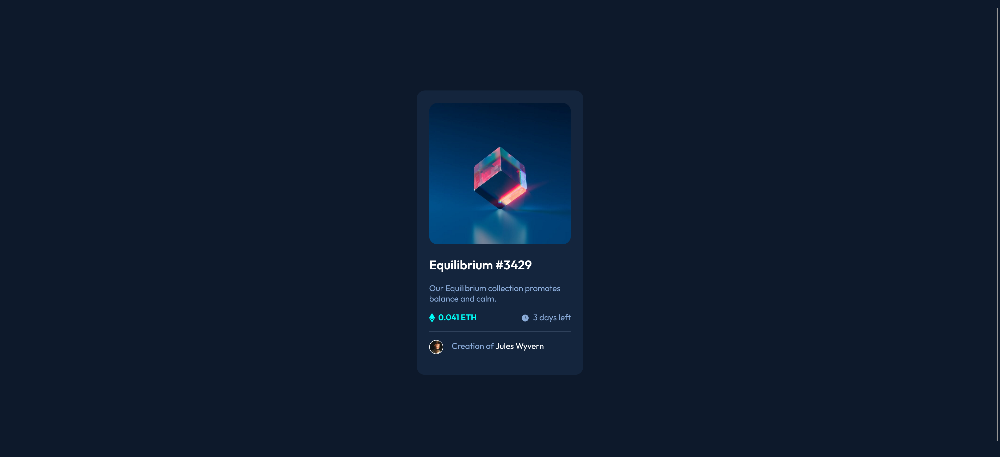

# Frontend Mentor - NFT preview card component solution

This is a solution to the [NFT preview card component challenge on Frontend Mentor](https://www.frontendmentor.io/challenges/nft-preview-card-component-SbdUL_w0U). Frontend Mentor challenges help you improve your coding skills by building realistic projects. 

## Table of contents

- [Overview](#overview)
  - [The challenge](#the-challenge)
  - [Screenshot](#screenshot)
  - [Links](#links)
- [My process](#my-process)
  - [Built with](#built-with)
  - [What I learned](#what-i-learned)
  - [Continued development](#continued-development)
  - [Useful resources](#useful-resources)
- [Author](#author)

## Overview

### The challenge

Users should be able to:

- View the optimal layout depending on their device's screen size
- See hover states for interactive elements

### Screenshot



### Links

- Solution URL: [Frontend Mentor](https://www.frontendmentor.io/solutions/nft-preview-card-component-bJf6zMFAkD)
- Live Site URL: [GitHub Pages Live Site](https://rrincones.github.io/NFT-preview-card-component/)

## My process

### Built with

- Semantic HTML5 markup
- CSS custom properties
- Flexbox

### What I learned

One thing I learned is to always include a height and width attribute in image tags as advised in the MDN documentation and elsewhere. Doing so prevents layout shifts when the page loads and thus contributes to a better user experience. I also learned to set the height to auto in my CSS in order to override the height attribute, which is in pixels, and make my image responsive. 

```html

```
```css
.avatar {
  width: 10%;
  height: auto;
  margin-right: 1rem;
  border: 1px solid white;
  border-radius: 50%;
  vertical-align: middle;
}
```

### Continued development

For future projects, I want to keep learning how to implement better solutions that lend to the optimal user experience. I want to get better at thinking through all the technical details. 

### Useful resources

- [Beginner's CSS Tutorial](https://www.youtube.com/watch?v=OXGznpKZ_sA) - Part 16 about images in this tutorial helped me during this project. 

## Author

- Frontend Mentor - [@rrincones](https://www.frontendmentor.io/profile/rrincones)
